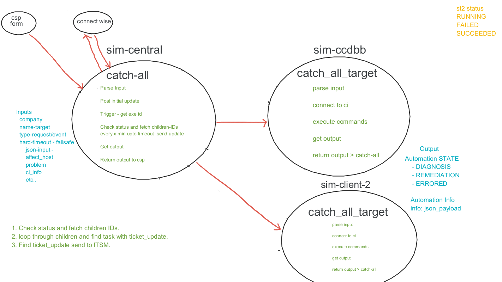

# sim-core pack

## Introduction 

This repository is to hold the files that make up the sim-core pack that hosts Ethan integrations starting with the CatchAll Workflow , a main workflow which will be an entry point when using SiM. The main responsibilities of this workflow is to be the master automation that gets called when invoking *ALL* internal and client automations. This workflow will internally call client speicific automations in customer SiM instances.


## Installation 

````
st2 pack install https://ethangroup.visualstudio.com/SPBU%20Automation/_git/sim_core

````
## Actions and Workflows

The following actions and workflows make up the pack ("`sim-core`"):

````
+------------------------------------------+----------+----------------------------------------------------------+
| ref                                      | pack     | description                                              |
+------------------------------------------+----------+----------------------------------------------------------+
| sim_core.catch_all_workflow              | sim_core | Ethan Core Automation                                    |
| sim_core.catch_all_target_workflow       | sim_core | catch_all_workflow_target                                |
| sim_core.get_execution_output_workflow   | sim_core | Get execution output                                     |
+------------------------------------------+----------+----------------------------------------------------------+

````
### sim_core.catch_all_workflow


This is the automation that is invoked by all external systems such as CSP every time an automation is needed which 
will inturn call other automations whether from SiM Central or other client SiM instance. This automation does the following:
	- Verify and validate input parameters from CSP
    - Invoke catch_all_workflow_target automation on the appropriate SiM instance 
	- Keep itsm(Connectwise) updated with the status/progress of the tasks

````
+---------------+--------------------------------------------------------------+
| Property      | Value                                                        |
+---------------+--------------------------------------------------------------+
| id            | 616fbff8c8101de118685ac6                                     |
| uid           | action:sim_core:catch_all_workflow                           |
| ref           | sim_core.catch_all_workflow                                  |
| pack          | sim_core                                                     |
| name          | catch_all_workflow                                           |
| description   | Ethan Core Automation pack                                   |
| enabled       | True                                                         |
| entry_point   | workflows/catch_all_workflow.yaml                            |
| runner_type   | orquesta                                                     |
| parameters    | {                                                            |
|               |     "robot_name": {                                          |
|               |         "type": "string",                                    |
|               |         "description": "target robot",                       |
|               |         "required": true,                                    |
|               |         "default": "ccdbb_core.user_exit_process"            |
|               |     },                                                       |
|               |     "robot_type": {                                          |
|               |         "type": "string",                                    |
|               |         "description": "type of robot",                      |
|               |         "default": "REQUEST"                                 |
|               |     },                                                       |
|               |     "robot_data": {                                          |
|               |         "type": "object",                                    |
|               |         "description": "Object with key value pairs of input |
|               | robot data"                                                  |
|               |     }                                                        |
|               | }                                                            |
| metadata_file | actions/catch_all_workflow.yaml                              |
| notify        |                                                              |
| output_schema |                                                              |
| tags          |                                                              |
+---------------+--------------------------------------------------------------+
````
### sim_core.catch_all_target_workflow

This is always the automation invoked second by the "`catch_all_workflow`" on the correct SiM instance.
The responsibilities of this automation are:
	- Invoke the appropriate automation on the client SiM instance 
    - Monitor the child automations as they execute for status and feedback to "`catch_all_workflow`"
````
+---------------+--------------------------------------------------------------+
| Property      | Value                                                        |
+---------------+--------------------------------------------------------------+
| id            | 6174f32bcef832a22c4147a4                                     |
| uid           | action:sim_core:catch_all_target_workflow                    |
| ref           | sim_core.catch_all_target_workflow                           |
| pack          | sim_core                                                     |
| name          | catch_all_target_workflow                                    |
| description   | catch_all_workflow_target                                    |
| enabled       | True                                                         |
| entry_point   | workflows/catch_all_target_workflow.yaml                     |
| runner_type   | orquesta                                                     |
| parameters    | {                                                            |
|               |     "name": {                                                |
|               |         "type": "string",                                    |
|               |         "description": "target robot",                       |
|               |         "required": true                                     |
|               |     },                                                       |
|               |     "type": {                                                |
|               |         "type": "string",                                    |
|               |         "description": "type of robot",                      |
|               |         "required": true                                     |
|               |     },                                                       |
|               |     "data": {                                                |
|               |         "type": "object",                                    |
|               |         "description": "Object with key value pairs of input |
|               | robot data",                                                 |
|               |         "required": true                                     |
|               |     },                                                       |
|               |     "ticket_id": {                                           |
|               |         "type": "string"                                     |
|               |     }                                                        |
|               | }                                                            |
| metadata_file | actions/catch_all_target_workflow.meta.yaml                  | 
| output_schema |                                                              |
| tags          |                                                              |
+---------------+--------------------------------------------------------------+
````
### sim_core.get_execution_output_workflow

This workflow is used to get the execution output of a child automation and updates the "`catch_all_workflow`" 
````
+---------------+--------------------------------------------------------------+
| Property      | Value                                                        |
+---------------+--------------------------------------------------------------+
| id            | 617403c7c8101de118685d2f                                     |
| uid           | action:sim_core:get_execution_output_workflow                |
| ref           | sim_core.get_execution_output_workflow                       |
| pack          | sim_core                                                     |
| name          | get_execution_output_workflow                                |
| description   | Get execution output                                         |
| enabled       | True                                                         |
| entry_point   | workflows/get_execution_output_workflow.yaml                 |
| runner_type   | orquesta                                                     |
| parameters    | {                                                            |
|               |     "execution_ids": {                                       |
|               |         "type": "array",                                     |
|               |         "required": true                                     |
|               |     },                                                       |
|               |     "ticket_id": {                                           |
|               |         "type": "string"                                     |
|               |     },                                                       |
|               |     "st2apikey": {                                           |
|               |         "type": "string",                                    |
|               |         "description": "St2 api key for getting execution    |
|               | output"                                                      |
|               |     }                                                        |
|               | }                                                            |
| metadata_file | actions/get_execution_output_workflow.meta.yaml              |
| notify        |                                                              |
| output_schema |                                                              |
| tags          |                                                              |
+---------------+--------------------------------------------------------------+
````
